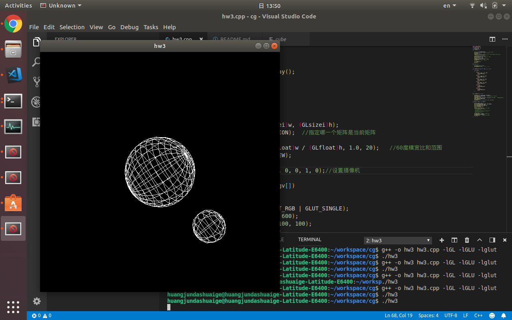
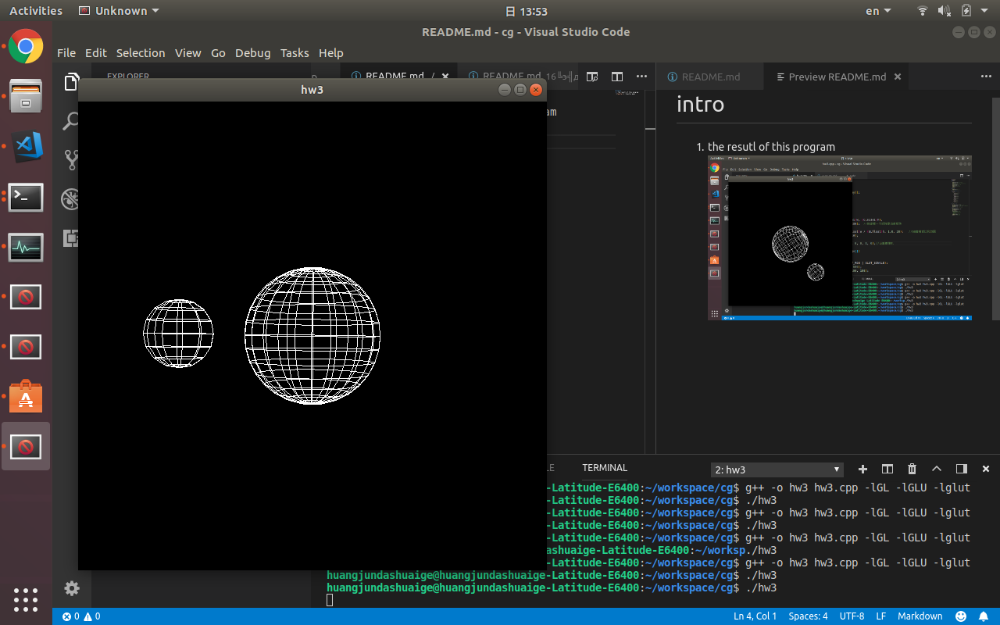
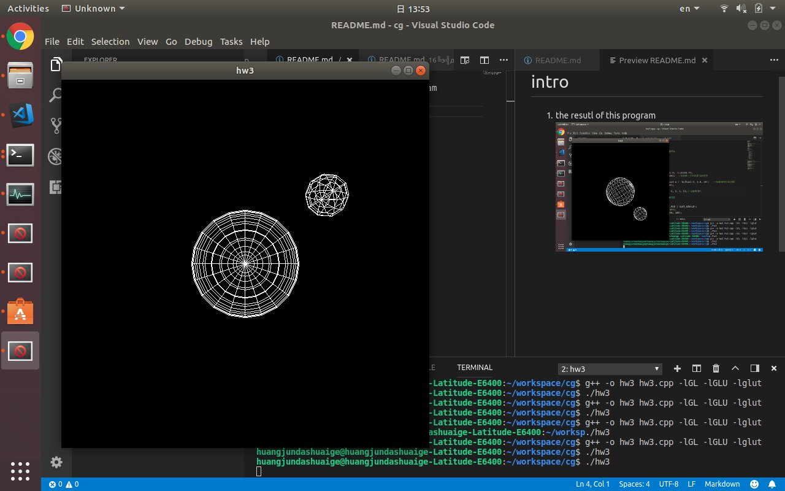

# intro 
1. the resutl of this program 




2. how to use 
d and shift+d can change the day which means the rotation of the small star

y and shift+Y can change the year which means the rotation of the small star rotate around the big star

q and shift+Q is to change the viewpoint which was implement by using glutroatef in the display function in the begining to make sure it can rotate the whole scence
(if define in other place you might not change it by call the keyword)

3. how to run
```
./install.sh
./hw3
```
only availiable in linux

