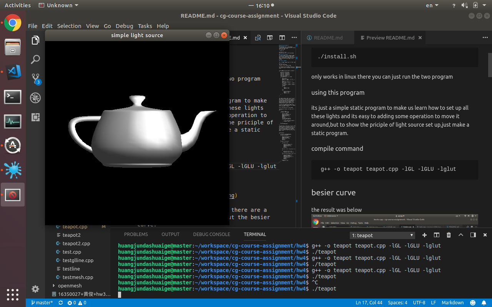

# cg course asssignment 5
## how to run
first because there is some dynaimc linking libary out there you need to place them in the right place,
you should type
```
./install.sh
```
only works in linux
there you can just run the two program

### using this program
its just a simple static program to make us learn how to set up all these lights and its easy to adding some operation to move it around,but to show the priciple of light source set up,just make a static program.

### compile command
```
 g++ -o teapot teapot.cpp -lGL -lGLU -lglut
```
## besier curve
the result was below


to accomplish this assigment there are a few interest point to do about the program

```
void display(void)  
{  
    glClear(GL_COLOR_BUFFER_BIT | GL_DEPTH_BUFFER_BIT);  
    glEnable(GL_DEPTH_TEST);
    glPushMatrix();  

    glColor3f(1.0f, 1.0f, 1.0f);  
    glEnable(GL_NORMALIZE); //according to the doc this will make less mistake in some cases
    glutSolidTeapot(teapot_size); 
    
    glPopMatrix();  

    glutSwapBuffers();  

}  
  
```

as you can see the drawing phrase of the teapot is rather simple,just one api call 

the really matter code statement was below
```
void SetupLights()  
{  

    glShadeModel (GL_SMOOTH);
    GLfloat ambientLight[]  = {0.2f,  0.2f,  0.2f,  1.0f};//enviormental light 
    GLfloat diffuseLight[]  = {0.9f,  0.9f,  0.9f,  1.0f};//slow reflection 
    GLfloat specularLight[] = {1.0f,  1.0f,  1.0f,  1.0f};//mirror reflection light 
    GLfloat lightPos[]      = {1.0f, -2.0f, 2.0f, 1.0f};//light source position，spot light
    //GLfloat lightPos2[]      = {1.0f, -2.0f, 2.0f, 0.0f};  
    //GLfloat spot_direction[] = {100.0f, -50.0f, 50.0f};
    GLfloat shinless[] = {50.0};
    glEnable(GL_LIGHTING);
    glLightfv(GL_LIGHT1, GL_POSITION, lightPos);
    //glLightfv(GL_LIGHT1, GL_SPOT_DIRECTION, spot_direction);
    //glLightfv(GL_LIGHT1, GL_SPOT_CUTOFF, deg);
    //glLightfv(GL_LIGHT1, GL_AMBIENT, ambientLight);     //set up the ebviormental light  
    glLightfv(GL_LIGHT1, GL_DIFFUSE, diffuseLight);     //set up the slow reflection light  
    glLightfv(GL_LIGHT1, GL_SPECULAR, specularLight);   //set up the mirror reflection light    
    glEnable(GL_LIGHT1);


    GLfloat ambientLight2[]  = {0.0f,  0.0f,  0.0f,  1.0f};//enviormental light 
    GLfloat diffuseLight2[]  = {0.5f,  0.5f,  0.5f,  1.0f};//slow reflection 
    GLfloat specularLight2[] = {0.5f,  0.5f,  0.5f,  1.0f};//mirror reflection light 
    GLfloat lightPos2[]      = {1.0f, -2.0f, 2.0f, 0.0f};//light source position，point light source
 
    glLightfv(GL_LIGHT0, GL_POSITION, lightPos2);        //set the light source position  
    glLightfv(GL_LIGHT0, GL_AMBIENT, ambientLight2);     //set up the ebviormental light  
    glLightfv(GL_LIGHT0, GL_DIFFUSE, diffuseLight2);     //set up the slow reflection light  
    //glLightfv(GL_LIGHT0, GL_SPECULAR, specularLight2);   //set up the mirror reflection light    

    glEnable(GL_LIGHT0);
    
    glEnable(GL_COLOR_MATERIAL);                        //start the setting of material  
    glColorMaterial(GL_FRONT_AND_BACK, GL_AMBIENT_AND_DIFFUSE);  //set up which face 
    glMaterialfv(GL_FRONT_AND_BACK, GL_SPECULAR, specularLight); //reaction to the material  
    //glMaterialfv(GL_FRONT_AND_BACK, GL_SHININESS, shinless);
    glMateriali(GL_FRONT, GL_SHININESS, 100);           //reflection rate   
    
/*
    GLfloat light_position[] = {50.0f, 0.0f, 50.0f, 1.0f };  
    glLightfv(GL_LIGHT1, GL_POSITION, light_position);  
    glEnable(GL_LIGHTING);  
    glEnable(GL_LIGHT0);  
    glDepthFunc(GL_LESS);  
    glEnable(GL_DEPTH_TEST);    
*/
```

above is the really matter code which is how to set up the right source light

1. its really hard to just according the photo of another photo then just make a program exactly like that,so you can see i actually do a lot of changes to my code to find out how to be more like the given photo.

2. and my achievement is that to accomplish work like that it need two light source.

3. one light source is the spot light which is 
```
GLfloat lightPos[]      = {1.0f, -2.0f, 2.0f, 1.0f};//light source position，spot light

```
to form the bright reflection in the center of the teapot

4. the second light source is a normal point light source which to form the reality aspect of the overall program which to be specific is the slight shadow all over the teapot
```
    GLfloat lightPos2[]      = {1.0f, -2.0f, 2.0f, 0.0f}
```

