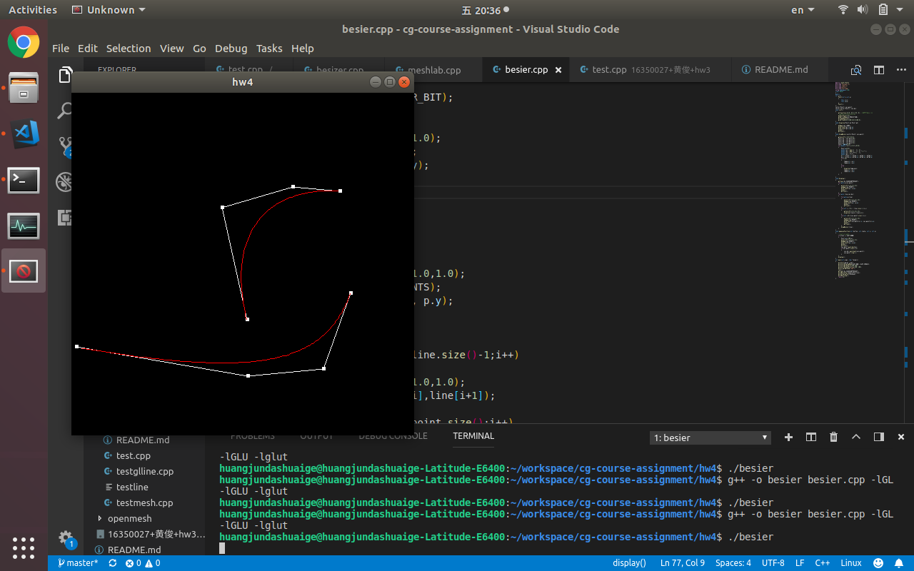
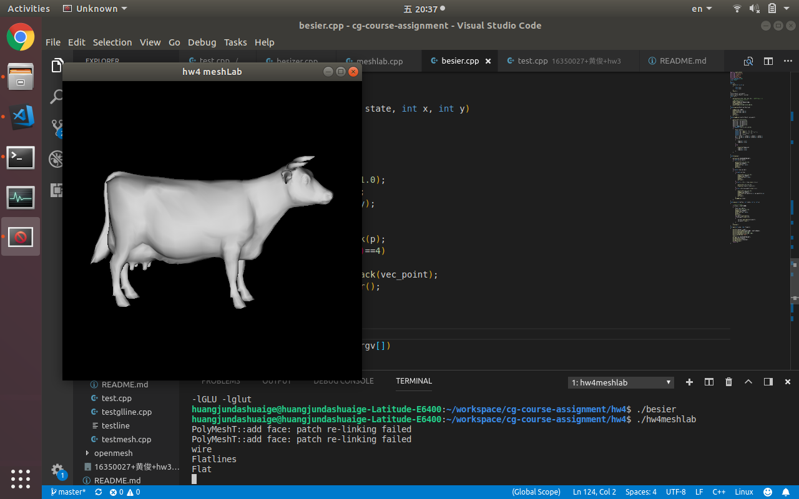
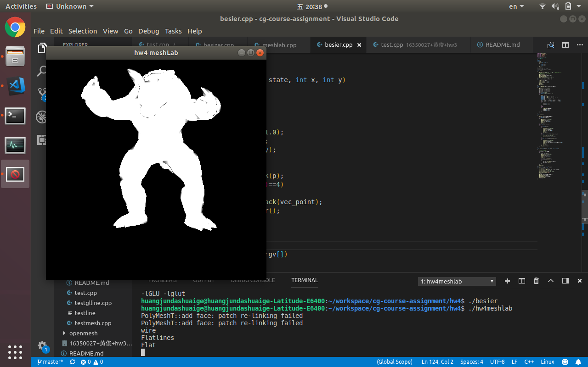
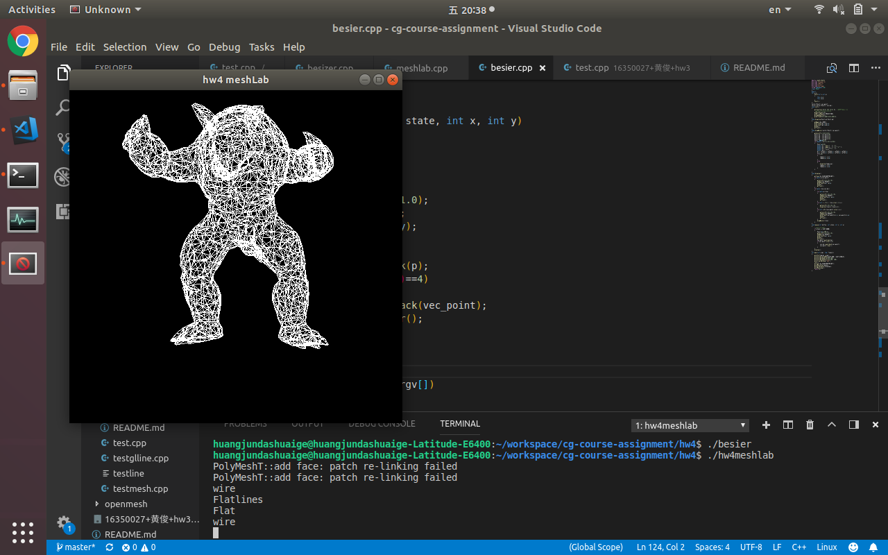

g++ -o hw4meshlab hw4meshlab.cpp -lGL -lGLU -lglut -lOpenMeshCore
# cg course asssignment 4

## besier curve
the result was below


to accomplish this assigment there are a few interest point to do about the besier curve.

```
void drawBezier(vector<Point> vec_point)
{
    glColor3f(1.0,0.0,0.0);
    Point p1 = vec_point[0];
    Point p2 = vec_point[1];
    Point p3 = vec_point[2];
    Point p4 = vec_point[3];
    Point temp_p(0,0);
    for(double t=0;t<=1.0;t+=0.01)
    {
        Point p(0,0);
        double a1 = pow((1 - t), 3);
        double a2 = pow((1 - t), 2) * 3 * t;
        double a3 = 3 * t*t*(1 - t);
        double a4 = t*t*t;
        p.x = a1*p1.x + a2*p2.x + a3*p3.x + a4*p4.x;
        p.y = a1*p1.y + a2*p2.y + a3*p3.y + a4*p4.y;
        if(t==0)
        {
            temp_p.x = p.x;
            temp_p.y = p.y;
        }
        else
        {
            drawLine(temp_p,p);
            temp_p.x = p.x;
            temp_p.y = p.y;
        }
    }
    
}
```

the code was above, what i want to say is that there is no perfect api for you to draw a besier curve,one of the apporach is to choose some point with same distance then we connect each of them with the disadjected one to them to make it feels like we actually draw a fluent curve.

of course the same distance means the x index is of same distance.and the y depend all on the besier formular.

as for the other part of the program
```
void mouse(int button, int state, int x, int y) 
{
    //cout<<1<<endl;
    if(state == GLUT_DOWN)
    {
        Point p(x,480-y);
        glColor3f(1.0,1.0,1.0);
        glBegin(GL_POINTS);
        glVertex2f(p.x, p.y);
        glEnd();
        glFlush();
        vec_point.push_back(p);
        if(vec_point.size()==4)
        {
            vec_ber.push_back(vec_point);
            vec_point.clear();
        }  
    }
    glutPostRedisplay();
}
```
the mouse move is that each click will add a point to the array and once there is four elements in the same array,since the array can form a besier curve already,in the next display move we will show the besier curve by calling the previous draw besier curve.

```
void display()
{
    glClear(GL_COLOR_BUFFER_BIT);
    for(auto p:vec_point)
    {
        glColor3f(1.0,1.0,1.0);
        glBegin(GL_POINTS);
        glVertex2f(p.x, p.y);
        glEnd();
        glFlush();   
    }
    for(auto line:vec_ber)
    {
        for(auto p:line)
        {
            glColor3f(1.0,1.0,1.0);
            glBegin(GL_POINTS);
            glVertex2f(p.x, p.y);
            glEnd();
            glFlush();
        }
        for(int i = 0;i < line.size()-1;i++)
        {
            glColor3f(1.0,1.0,1.0);
            drawLine(line[i],line[i+1]);
        }
        for(int i=0;i<vec_point.size();i++)
        {
            glColor3f(1.0,1.0,1.0);
            glBegin(GL_POINTS);
            glVertex2f(vec_point[i].x, vec_point[i].y);
            glEnd();
            glFlush();
        }
        drawBezier(line);
    }
}
```

## meshlab program




above all,the idea of this program is very simple,that is we read the vertex and plane,then just simple use opengl api to represent them all.

but the diffcuty part is that there are actually three forms of 3d model saving data.each of them has different representation method of data.so if you just simply write the program to reginaize them from three times is kind messy and probably hard to bug free.so i search on the net.

there do have more elegent solution for thsi method,there's a libary called openmesh has it own i/o api can read different types of file then return the standard format of data.

so let's stop rewrite the wheels and lets get our hand dirty.
```
    OpenMesh::IO::Options opt;
    OpenMesh::IO::read_mesh(mesh, file, opt);
```

after forming a 3d model,every else will just become as easy as hell,all you need to do is to dealing with the control module
```
void keyboard(int key, int x, int y) {
    switch (key) 
    {
    case GLUT_KEY_F1:
        currentfile++;
        if(currentfile>file_size-1)
            currentfile = 0;
        readfile(file_arr[currentfile]);
        scale = 1.0f;
        if(currentfile == 2)
            scale = 0.01f;
        init();
        break;
    case GLUT_KEY_F2:
        if (showFace == true) 
        {
            showFace = false;
            showWire = true;
            cout<<"wire"<<endl;
        }
        else if (showWire == true)
        {
            showWire = false;
            showFlatlines = true;
            cout << "Flatlines" << endl;
        }
        else if (showFlatlines == true) 
        {
            showFlatlines = false;
            showFace = true;
            cout << "Flat" << endl;
        }
        break;
    case GLUT_KEY_UP://move using up and down and left and right
        y_position += 0.1;
        break;
    case GLUT_KEY_DOWN:
        y_position -= 0.1;
        break;
    case GLUT_KEY_LEFT:
        x_position -= 0.1;
        break;
    case GLUT_KEY_RIGHT:
        x_position += 0.1;
        break; 
    default:
        break;
    }
    glutPostRedisplay();
}
```

as for the display part of code.
```
    if (face_flag)
    {
        drawFace();
    }
    else if (flatline_flag) 
    {
        drawLine();
        drawFace();
    }
    else if (line_flag)
    {
        drawLine();
    }
    glutSwapBuffers(); //swap the buffer bit
```

